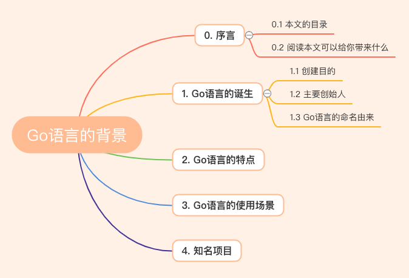
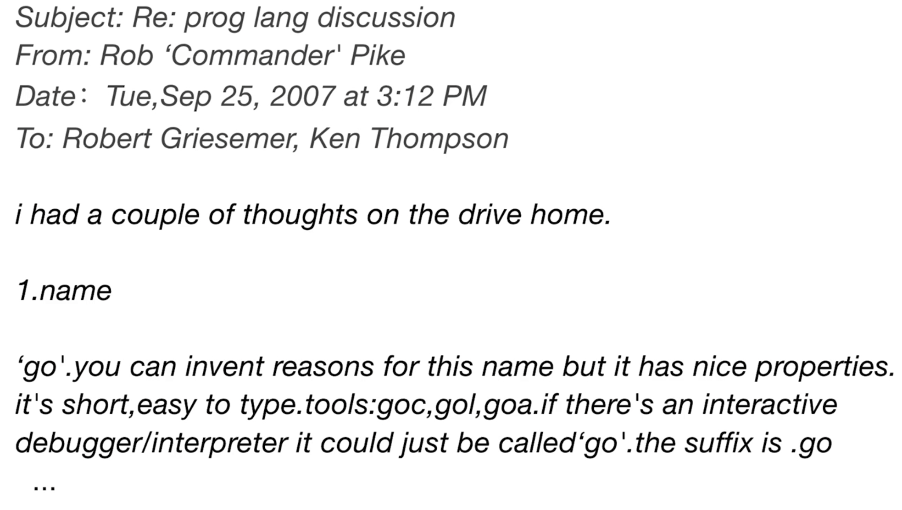

# Go语言的背景

> 我使用 Go 语言也快2年了，现在如果让我当老师来讲讲 Go 语言，说实话我心里没谱。所以我现在自己需要好好思考总结一下。我认为好好去了解一个语言的背景，有利于更好的学习！
>
> 作为新人可能会问以下几个问题：
>
> 1. Go 语言是什么？是什么类型的语言？
> 2. 编程语言都这么多比如：C、C++、Java、Python等，为什么要创建 Go 语言？
> 3. Go 语言的什么特点？Go 语言的优点是什么？Go 语言的缺点是什么？
> 4. Go 语言的应用场景？能解决什么问题？

## 0. 序言

### 0.1 本文的目录

### 0.2 阅读本文可以给你带来什么

了解Go语言诞生，语言特点，应用场景以及知名项目。

## 1. Go语言的诞生

### 1.1 创建目的

> **新事物的产生都是被需要的**。

当时Google开发遇到的以下这些问题：

- 大量的C++代码，同时又引入了Java和Python
- 成千上万的工程师
- 数以万计行的代码
- 分布式的编译系统
- 数百万的服务器

痛点：

- 编译慢
- 失控的依赖
- 每个工程师只是用了一个语言里面的一部分
- 程序难以维护（可读性差、文档不清晰等）
- 更新的花费越来越长
- 交叉编译困难

对开发程度和系统效率在很多情况下不能兼得。要么执行效率高，但低效的开发和编译，如C++；要么执行低效，但拥有有效的编译，如.NET、Java；所以需要一种拥有较高效的执行速度、编译速度和开发速度的编程语言。

所以，他们当时设计Go的目标是为了消除各种缓慢和笨重、改进各种低效和扩展性。Go是由那些开发大型系统的人设计的，同时也是为了这些人服务的；它是为了解决工程上的问题，不是为了研究语言设计；它还是为了让我们的编程变得更舒适和方便。

但是结合Google当时内部的一些现实情况，如很多工程师都是C系的，所以新设计的语言一定要易学习，最好是C-like的语言；因为有太多的分布式系统、太多的开发者，所以新的语言一定要可以Scale，这个包括开发、工程师、代码、部署和依赖；20年没有出新的语言了，所以新设计的语言必须是现代化的（例如内置GC）等情况，他们觉得要实现这个目标就需要Go成为一个大家都认可的语言。

### 1.2 主要创始人

Go的三个作者分别是： Rob Pike（罗伯.派克），Ken Thompson（肯.汤普森）和Robert Griesemer（罗伯特.格利茨默） 。

- Rob Pike：曾是贝尔实验室（Bell Labs）的Unix团队，和Plan 9操作系统计划的成员。他与Thompson共事多年，并共创出广泛使用的UTF-8 字元编码。
- Ken Thompson：主要是B语言、C语言的作者、Unix之父。1983年图灵奖（Turing Award）和1998年美国国家技术奖（National Medal of Technology）得主。他与Dennis Ritchie是Unix的原创者。Thompson也发明了后来衍生出C语言的B程序语言。
- Robert Griesemer：在开发Go之前是Google V8、Chubby和HotSpot JVM的主要贡献者。

### 1.3 Go语言的命名由来

这是一封由 Rob Pike 在 2007 年 9 月 25 号，星期二，下午 3：12 回复给 Robert Griesemer、Ken Thompson 的有关编程语言讨论主题的邮件，邮件正文大意为：在开车回家的路上我得到了些灵感。1.给这门编程语言取名为“go”，它很简短，易书写。工具类可以命名为：goc、 gol、goa。交互式的调试工具也可以直接命名为“go”。语言文件后缀名为 .go 等等

这就是 Go 语言名字的来源，自此之后 Robert、Rob 和 Ken 三个人开始在 Google 内部进行了研发，一直到了 2009 年，Go 正式开源了，Go 项目团队将 2009 年 11 月 10 日，即该语言正式对外开源的日字作为其官方生日。源代码最初托管在 [http://code.google.com](http://link.zhihu.com/?target=http%3A//code.google.com) 上，之后几年才逐步的迁移到 GitHub 上。

Go语言最开始是谷歌工程师20%时间的产物（谷歌的“20%时间”工作方式，允许工程师拿出20%的时间来研究自己喜欢的项目）。

## 2. Go语言的特点

Go主要有**静态语言、天生并发、内置GC、安全性高、语法简单、交叉编译和编译快速**这几个方面的特性。这些特性决定了Go的三个高富帅特性：**运行快、开发快和部署快**，而这些特性都是针对Google遇到的一些痛点来设计的。

## 3. Go语言的使用场景

对于高性能分布式系统领域而言，Go 语言无疑比大多数其它语言有着更高的开发效率。它提供了海量并行的支持，这对于游戏服务端的开发而言是再好不过了。总而言之，Go语言是一门全能型语言，主要用于开发大型软件。

目前Go主要应用在下面这些系统：

1. 服务器编程，以前你如果使用C或者C++做的那些事情，用Go来做很合适，例如处理日志、数据打包、虚拟机处理、文件系统等。
2. 分布式系统、数据库代理器等，例如Etcd。
3. 网络编程，这一块目前应用最广，包括Web应用、API应用、下载应用，而且Go内置的net/http包基本上把我们平常用到的网络功能都实现了。
4. 数据库，前一段时间Google开发的Groupcache，Couchbase的部分组建，Tidb，Cockroachdb，Influxdb等。
5. 云平台，目前国外很多云平台在采用Go开发，CloudFoundy的部分组建，前VMare的技术总监自己出来搞的Apcera云平台。

## 4. 知名项目

**Go语言制霸了云计算领域**。

* Kubernetes
* Docker
* etcd
* Prometheus
* Grafana
* bibi
* 知乎
* ...

**参考文档**：

https://studygolang.com/articles/20096

https://blog.csdn.net/point_to_line/article/details/107728098