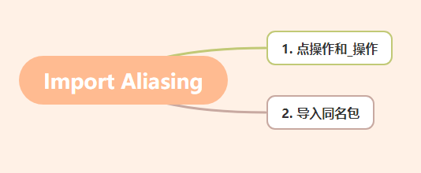

# Import Aliasing

## 0. 目录



## 1. 点操作和_操作

导入包时，我们会看到如下**点操作** 和**_操作**:

```go
import (
    . "xxx/xxx/xxx"
    _ "xxx/xxx/xxx"
)
```

**点操作**: 可以理解为包名不需要写了，比如 fmt.Println("Hello world!")，只要改成 Println("Hello world!")。

**_操作**: 该包内的所有 init() 函数都会被执行，仅希望包内的 init() 函数被执行。

## 2. 导入同名包

我们导入包时很容易出现同名，那我们该怎么做呢？解决方案如下：

```go
import (
    "text/template"
    htemplate "html/template" // this is now imported as htemplate
)
```

参考资料：

https://stackoverflow.com/questions/10408646/how-to-import-and-use-different-packages-of-the-same-name

